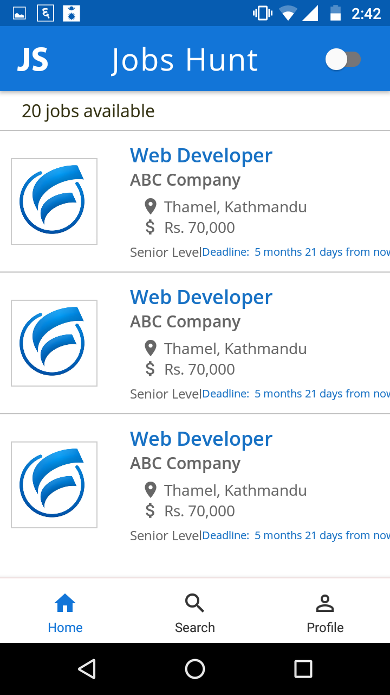
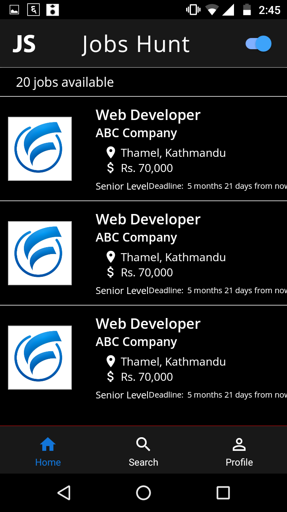
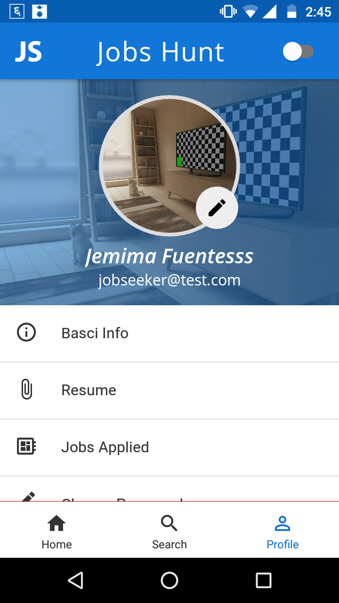
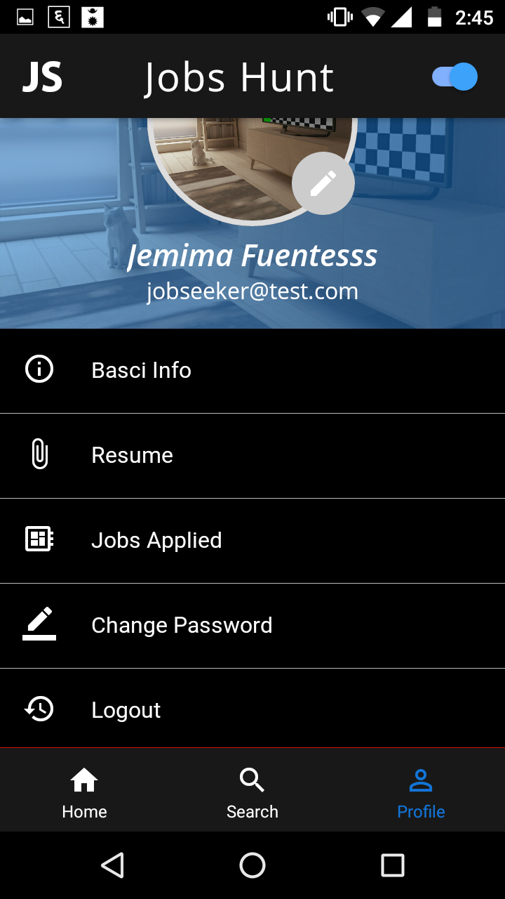
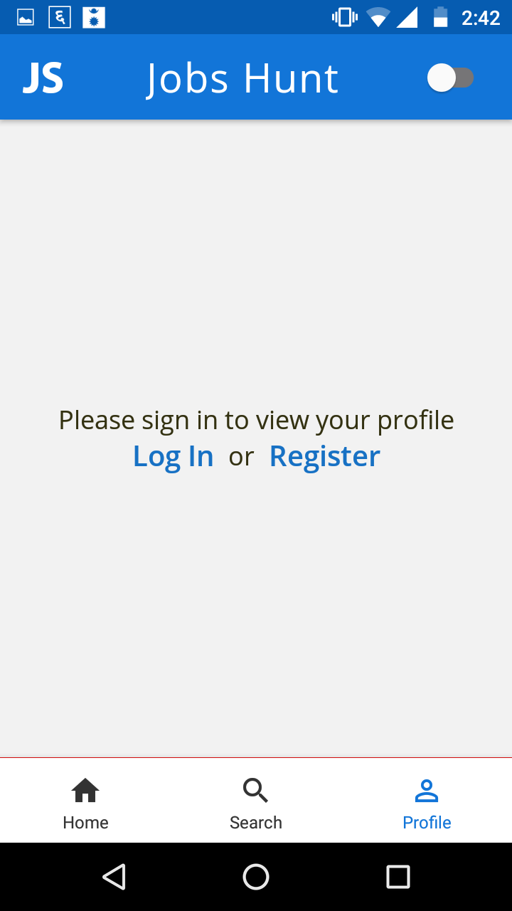
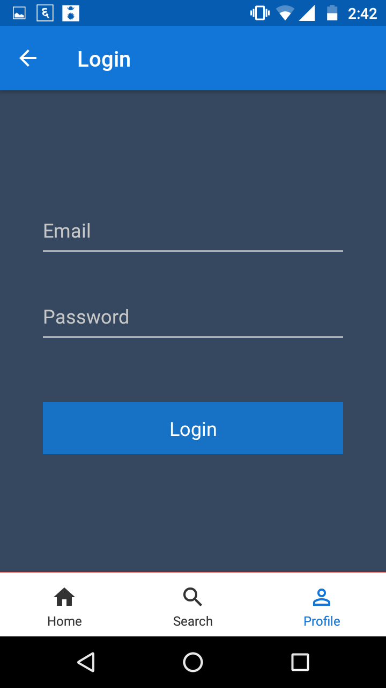
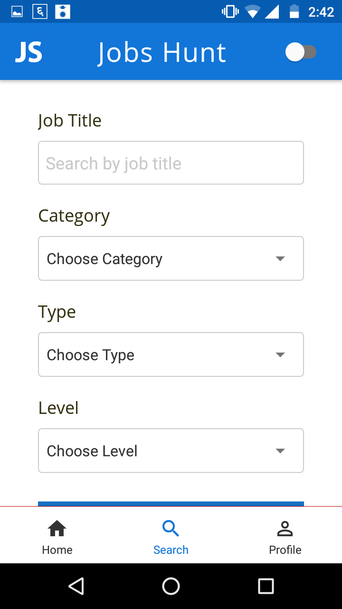

### Job Hunts Mobile App

Job portal mobile applicaiton built with [React Native](https://github.com/facebook/react-native), a framework for building native apps using React and leverages RestFul APIs built with [Lumen](https://github.com/laravel/lumen), the stunningly fast micro-framework by Laravel.

<div style="border-bottom: 1px solid #eaecef"></div>

#### Installation
You must have expo-cli installed. If not installed you can follow guides [here](https://docs.expo.io/workflow/expo-cli/) to install expo-cli.
You also need to have andriod studio downloaded in your system.You can visit their site to download android studio clicking [here](https://developer.android.com/studio) .
<ol>
    <li>git clone https://github.com/maddyhunter76/Jobportal-Moblie-App.git</li>
    <li>cd Jobportal-Mobile-App </li>
    <li>npm install </li>
    <li>expo start</li>
</ol>

<div style="border-bottom: 1px solid #eaecef"></div>

#### Technologies
```
React Native 
Lumen v5.5
```

<div style="border-bottom: 1px solid #eaecef"></div>

##### Some screenshots in of app views in Motorola G3(5.0')  
<div style="display:flex; flex-wrap: wrap; flex-direction: row; justify-content: space-around; align-items: flex-start">
 







</div>
